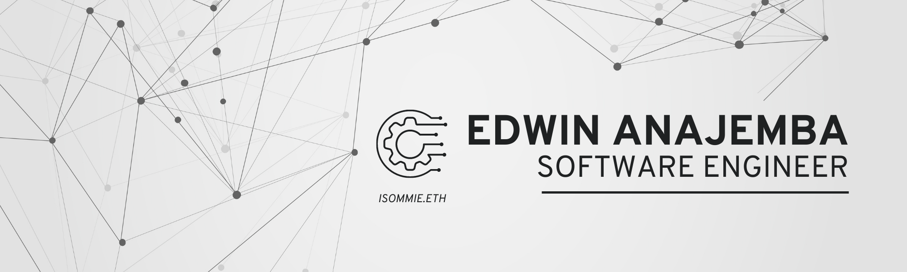

<!---
anajembaedwin/anajembaedwin is a ✨ special ✨ repository because its `README.md` (this file) appears on your GitHub profile.
You can click the Preview link to take a look at your changes.
--->

    
 
Hi there, 👋🏽&nbsp I'm a Fullstack JavaScript, and Blockchain Developer. Feel free to stay a while and browse through my latest projects if you'd like to see what I've been working on. Lastly, don't hesitate to reach out if you would like to hire me or collaborate on anything web development, open-source, and/or paid projects! <em>(PS: This portfolio is under construction)</em>

<!-- SOCIALS
<h1 align="center">Contact Me</h1>
  
   
    
    
       
    
  
 -->
  
 <!-- Stats -->
  <h1 align="center">Code Stats</h1>

 

 

<h1 align="center">Technologies</h1>
   

      
      
      
      
      
      
      
      
      
      
      
      
      
      
      
      
      
      
      
      
      
      
      
      
      
      
      
    

    <h1 align="center">Projects</h1>
<table bordercolor="#66b2b2">
  
  <tr>
    <td width="50%" valign="top">
      <h3 align="center">Dummy 1</h3>
         
        
         
        

            
        
    
      

        
<strong>HTML, CSS3, Javascript, Typescript, Handlebars, React, Redux, Node.js, AWS, DynamoDB </strong> - A cloud based voting system to improve voter engagement, save time, create a better voter experience, and guarantee election integrity.

    </td>
    <td width="50%" valign="top">
      <h3 align="center">Dummy 2</h3>
         
      
         
        

          
  
   
      

        
<strong>Javascript, React, Redux, RestAPIs, NodeJs, WebRTC </strong> - A platform that will power remote work in the Web3 future and make it feel as good as sitting across the desk from your friends. Remote work that still allows for those moments of serependity.

    </td>
  </tr>
  
  <tr>
    <td width="50%" valign="top">
      <h3 align="center">Dummy 3</h3>
       
        
       
   
   
   
   
      

        
<strong>HTML5, CSS3, & Javascript</strong> - A responsive E-commerce product page with lightbox gallery and Cart Functionality.

    </td>
    <td width="50%" valign="top">
        <h3 align="center">Dummy 4</h3>
         
        
         
         
   
   
  
      

        
<strong>HTML5, HTTP, REST, Vercel, ContextAPIs, Javascript, Tailwind, Daisy Ui </strong>
            -  A platform that uses GitHub API to fetch user data from the GitHub database and display a user's information.

    </td>
  </tr>
    
   <tr>
    <td width="50%" valign="top">
      <h3 align="center">Dummy 5</h3>
       
        
       
   
   
   
   
      

        
<strong>HTML5, CSS3, & Javascript</strong> - A responsive E-commerce product page with lightbox gallery and Cart Functionality.

    </td>
    <td width="50%" valign="top">
        <h3 align="center">Dummy 6</h3>
         
        
         
         
   
   
  
      

        
<strong>HTML5, HTTP, REST, Vercel, ContextAPIs, Javascript, Tailwind, Daisy Ui </strong>
            -  A platform that uses GitHub API to fetch user data from the GitHub database and display a user's information.

    </td>
  </tr>
    
</table>

<!-- SOCIALS -->
<h1 align="center">Contact Me</h1>

    Please reach out to me with the following details:
<form>
  <label for="name">Name:</label> 
  <label for="email">Email:</label> 
  <label for="subject">Subject:</label> 
  <label for="message">Message:</label> 
</form>

  
   
    
    
       
    
  

  
<!-- <h1 align="center">Connect</h1>
  
   
    
    
       
    
  
 -->
